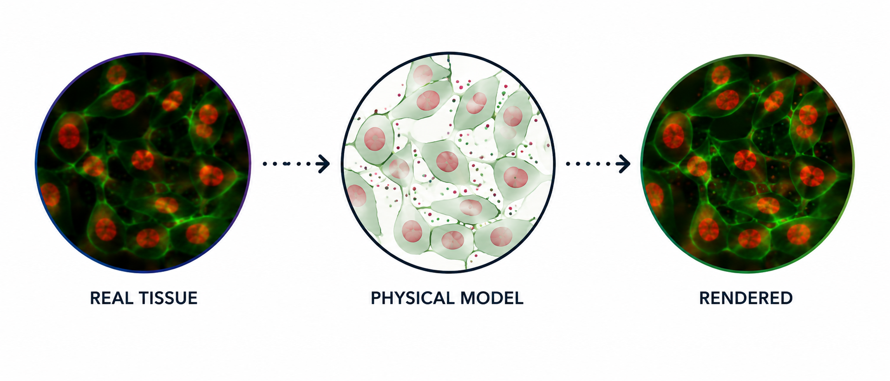

# xeSim


**Procedural-mechanistic Xenium tissue simulator.**

xeSim fits a hybrid physics-based model combined with a neural net renderer for Xenium bundles. The models parameters and scene configuration are optimized to best *explain* the experimentally-observed data: re-rendering the bundle should produce something that looks very similar to the original measurement, but every pixel and molecule in that data is traceable back to its virtual cell source. By constraining the staining and molecular data by the physical model, such simulations aim to provide realistic-looking data where the ground truth is actually known.



## Install

```bash
# 1. xeSim (this repo) — include the io + analysis extras for full functionality
git clone <this-repo-url> xeSim
cd xeSim
pip install -e ".[io,analysis]"

# 2. cellAdmix-core (sister package — transcript NMF priors).
#    Built from C++ via scikit-build-core; needs a working CMake toolchain.
#    See cellAdmix-core/docs/install.md for system-dependency details.
git clone https://github.com/kharchenkolab/cellAdmix-core
python -m pip install -e cellAdmix-core/python --no-build-isolation
```

Skip cellAdmix-core only if you'll always pass `--no-transcripts` to
`fit-model` (transcript-based features — per-gene compartments, per-cell-type
negbin counts, factor-derived gene assignment — will then be unavailable).

A CUDA GPU is required for `fit-model`. Inference (`explain`) works on
CPU but is much slower.

## Quick start

```bash
# Fit (~30-60 min on an A100). cellAdmix (sister package, transcript NMF)
# is run automatically on the bundle. Pass --celladmix-run PATH to reuse
# an existing fit, or --no-transcripts to skip.
xesim fit-model PATH/TO/BUNDLE --annotations PATH/TO/cell_types.csv \
    --out my_model/

# Re-render the real bundle through the model (2D or 2.5D)
xesim explain PATH/TO/BUNDLE --model my_model/ --out explained/ \
    --scene-mode 2d            # or 2.5d for z-stack output
```

Outputs are written as **standard Xenium bundles** (image stack +
`cells.parquet` + `transcripts.parquet` + `ground_truth/`).

## Python API

```python
from xesim import XesimModel
model = XesimModel.fit("path/to/bundle", "path/to/cell_types.csv",
                          out_dir="my_model/")
# or load: model = XesimModel.load("my_model/")
items = model.explain("path/to/bundle")
```

## Inspection helpers

```bash
xesim inspect-bundle PATH/TO/BUNDLE
xesim inspect-model my_model/
```

## Documentation

- [`docs/quickstart.md`](docs/quickstart.md) — installation + first run.
- [`docs/model.md`](docs/model.md) — what is modeled, pipeline schematic,
  2D / 2.5D outputs, real-vs-rendered examples.
- [`docs/prior_estimation.md`](docs/prior_estimation.md) — 3D nucleus
  shape priors fit from 2D polygons via an ellipsoid observation model
  (consumed by the 2.5D scene mode).

## Status

Pre-release. Reference fits exist for the Xenium pancreas membrane (377
genes) and Xenium breast 5K (8,456 targets) bundles. Cross-bundle
fidelity tuning is ongoing.
