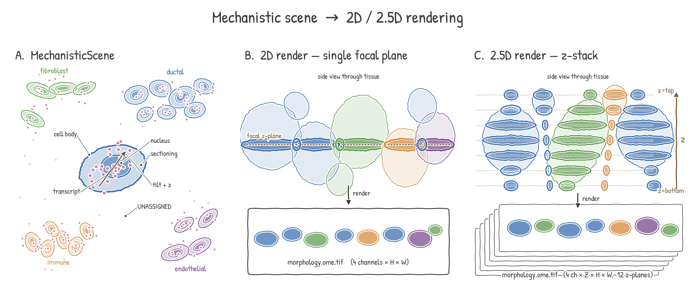
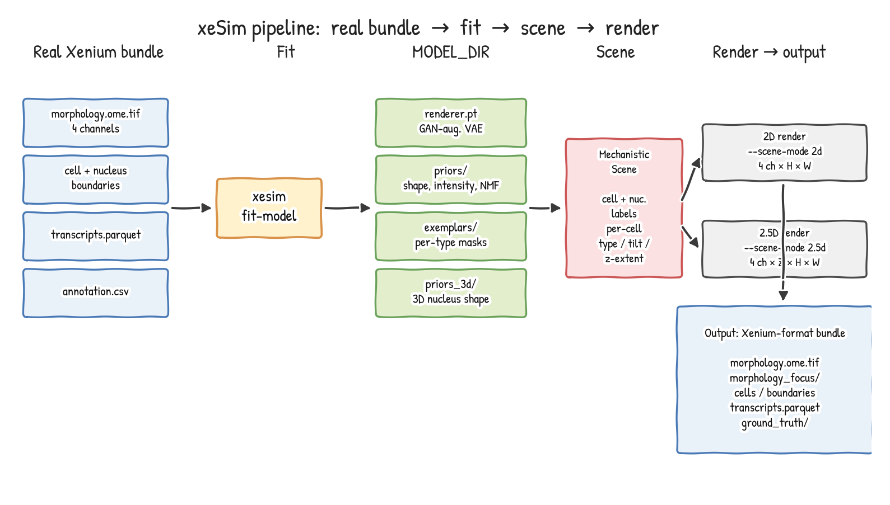
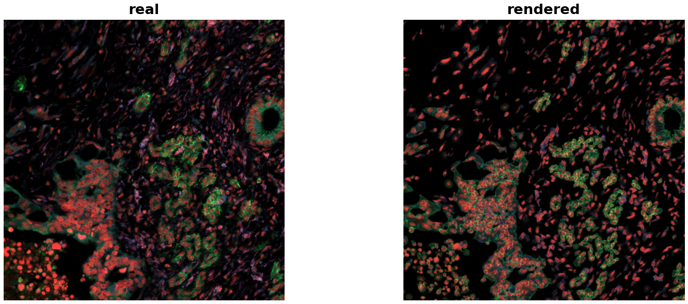
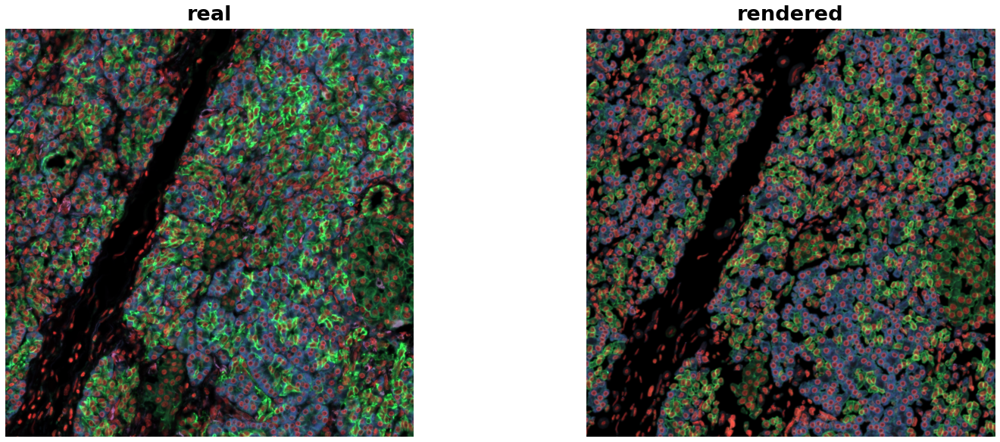
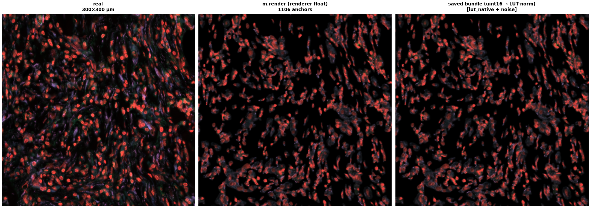
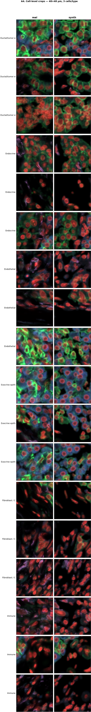

# Model

xeSim is a **procedural-mechanistic** simulator of a Xenium tissue
section. It fits a generative model from a single Xenium bundle, and
then either *explains* the bundle (re-renders the same tissue through
the model) or *generates* a brand-new bundle (samples scene state from
the fitted priors).

The design rule: **every realistic-looking pixel must be traceable to
explicit per-cell or per-component state**. The renderer is the only
learned component, and it is bounded to a per-cell residual on top of a
mechanistic rough render. It cannot move features, invent untracked
cells, or operate as a black box.

## The mechanistic scene and the two render modes



Internally, every render — explained or generated — flows through the
same intermediate object, the **`MechanisticScene`**:

- **A.** Cells of various types are placed in a 2D tissue plane, each
  with a nucleus, a sectioning state, a per-cell 3D tilt, and a list
  of transcripts (assigned cell-id or UNASSIGNED). The scene is the
  full causal state of the simulation — every output pixel and every
  transcript is traceable back to one of these entries.
- **B.** In **2D** mode (`--scene-mode 2d`) the renderer takes the
  scene at a single focal plane and produces a four-channel image.
  Tilted cells appear in cross-section as flattened ellipses on the
  plane; cells fully above or below the focal plane don't render.
- **C.** In **2.5D** mode (`--scene-mode 2.5d`) the renderer
  produces an entire **z-stack** (12 planes by default, 3 µm step
  across 33 µm of depth). The same tilted ellipsoid is sliced at
  every plane, so cells go in and out of focus the way they do in a
  real Xenium acquisition. Per-cell tilt and z-extent are sampled
  from the fitted 3D-nucleus priors (see
  [`prior_estimation.md`](prior_estimation.md)).

The 2D output is what you load to do flat morphological analysis;
the 2.5D output is what you load if downstream tools need depth
information (Xenium Explorer's z-slider, multi-z segmentation, etc.).

## Pipeline



Five stages, left to right:

1. **Real bundle inputs.** A standard Xenium output directory: the
   morphology stack (DAPI / membrane / 18S / aSMA), cell + nucleus
   boundary polygons, transcripts, and a cell-type annotation CSV.

2. **Fit (`xesim fit-model`).** Extracts canonical training crops,
   fits per-cell-type priors (cell + nucleus shape, intensity scatter,
   tissue neighborhood, sectioning quality, polyA radial spectrum),
   trains a small **GAN-augmented VAE renderer**, fits **3D nucleus
   shape priors** (per type) for the 2.5D path, and writes a
   self-contained `MODEL_DIR/`.

3. **MODEL\_DIR.** Four artifacts: `renderer.pt`, `priors/`,
   `exemplars/`, `priors_3d/`. Independently inspectable; nothing is
   pickled.

4. **Scene composition.** Builds the `MechanisticScene` shown in
   panel A above. The scene can come from either:
   - **`xesim explain BUNDLE`** — reuse the real bundle's cells +
     types as the scene state (every output cell corresponds 1:1 to a
     real cell);
   - **`xesim generate`** — sample new cell positions and types from
     the fitted priors (no real-bundle alignment).

5. **Render → output.** Either the 2D or 2.5D path above. Both modes
   write the result as a **Xenium-format bundle** so it loads in
   Xenium Explorer and other downstream tools without modification.

## What is being modeled

The generative state at the **scene level** is:

| Layer | What it represents | How it is fit |
|---|---|---|
| Tissue architecture | Per-domain type composition, neighbor-conditional type sampling | `priors/tissue_neighborhood.json` |
| Cell shape | Per-type real-mask exemplars + sectioning state | `exemplars/` from real bundle's polygons |
| 3D nucleus shape | Per-type log-radius + axis-ratio anisotropy (volume-preserving) | `priors_3d/nucleus_priors.json` |
| Mechanistic rough | Deterministic per-pixel DAPI / membrane / polyA from per-type efficiencies | `priors/mechanistic_params.json`, `intensity_scatter.json` |
| Renderer residual | Bounded GAN-augmented VAE that adds high-frequency realism on top of rough | `renderer.pt` (V37bUNet + per-cell `CellEncoder` + PatchGAN) |
| Sectioning state | Per-cell "how much of the cell is in this section" prior | `priors/sectioning_states.json` |
| Transcripts | Per-type NMF factors + Negative-Binomial count priors (assigned + UNASSIGNED tail), via the cellAdmix sister package (run automatically on the bundle, or supply `--celladmix-run PATH`) | `priors/transcripts_nmf.json` |

The renderer is bounded: its raw output is passed through
`tanh(out) * residual_scale` with `residual_scale ≈ 0.30`, so it can
only modify the mechanistic rough by a fraction of its dynamic range.
This is the structural guarantee that the model cannot drift away from
the cells/types accounted for in the scene.

See [`prior_estimation.md`](prior_estimation.md) for the 3D nucleus
prior model and fit (with the ellipsoid observation schematic).

## 2D output

`xesim explain BUNDLE --model MODEL_DIR --out OUT/ --scene-mode 2d`

Produces a single-plane Xenium-format bundle. Layout:

```
OUT/
├── morphology.ome.tif         # z-stack-shaped, one z-plane
├── morphology_focus/
│   ├── morphology_focus_0000.ome.tif   # DAPI
│   ├── morphology_focus_0001.ome.tif   # ATP1A1/CD45/E-Cad
│   ├── morphology_focus_0002.ome.tif   # 18S
│   └── morphology_focus_0003.ome.tif   # alphaSMA/Vim
├── cells.parquet              # one row per synthesized cell
├── cell_boundaries.parquet
├── nucleus_boundaries.parquet
├── transcripts.parquet        # x_location, y_location, gene, cell_id
└── ground_truth/
    ├── cells_synth.parquet           # full causal state per cell
    └── molecule_provenance.parquet   # source of each transcript
```

Pixel intensities are calibrated to real Xenium scale (`lut_native`
mode: `pixel = lo + s · (hi - lo)` where `(lo, hi)` is the model's per-
channel display LUT). Sensor noise (Gaussian read + Poisson shot,
calibrated per channel from the real bundle) is added at write time.

## 2.5D output

`xesim explain BUNDLE --model MODEL_DIR --out OUT/ --scene-mode 2.5d`

Same on-disk layout, with `morphology.ome.tif` now a full z-stack
(12 planes by default, 3 µm step covering 33 µm of imaged depth).
Each cell is given:

- a per-type **z-extent** (from the 3D nucleus prior plus the cell's
  observed 2D area),
- a **tilt** orientation initialized from PCA on the cell's polygon
  and refined by a Markov-random-field pass that aligns neighboring
  cells (smooth tilt field),
- a **z-center** sampled per cell.

Cells are then rendered through the renderer at each z-plane with the
appropriate cross-section, producing realistic DAPI multi-z stacks
that match the real bundle's depth-of-field pattern (cells go in and
out of focus across z).

## Real vs rendered

Each panel shows the same 300 × 300 µm tile rendered three ways:

- **real** — bundle morphology read straight from the Xenium file
- **m.render** — direct renderer output (`model.render` on the same
  scene composition)
- **saved bundle** — what's written to the synth `morphology.ome.tif`
  after the LUT + noise calibration

All three are placed in the same LUT-normalized intensity space so the
panels are directly comparable. The middle and right panels matching
each other to visual identity is the **writer-faithfulness check**:
whatever the renderer produces ends up on disk unchanged.

### Pancreatic ductal region



A duct cross-section with surrounding stroma (943 cells in the tile).
The synth captures the duct's E-cadherin ring pattern (green) and the
DAPI distribution of surrounding fibroblasts. Visible gap: aSMA
(magenta) is under-rendered — fibrotic regions in real show stronger
magenta texture than synth.

### Endocrine islet



A densely-packed islet of endocrine cells (1,588 cells). DAPI density
and per-cell sizes match real closely. Visible gap: the renderer
over-produces green (ATP1A1 / E-cadherin) on the densely-packed
epithelial cells, and the dark stromal clefts between islet lobules
that real shows are filled in by the synth.

### Fibrotic stroma



A fibroblast / CAF rich stromal region (1,106 cells; ~62% Fibroblast,
~30% Immune). Visible gap: the elongated stromal nuclei come through,
but the diffuse aSMA texture between cells is weaker in synth than
real — same root cause as the ductal panel.

Both stain-balance gaps (under-rendered aSMA, over-rendered green on
dense epithelium) are consistent with the current renderer's uniform
per-channel reconstruction weight and are queued for a future training
iteration that uses per-channel weighting.

### Single-cell zoom

Zooming in by an order of magnitude — 48 µm crops centered on
individual cells, three picks per cell type:



At this scale you can read off per-channel fidelity directly: nuclear
DAPI shape and intensity, the membrane ring on epithelial cells, the
sparse cytoplasm of immune cells. The same stain-balance gaps from the
region panels are visible here cell by cell.

## Status

- **2D:** production-ready, used as the default for whole-bundle output.
  The bundle writer is round-trip faithful: the saved bundle's pixels
  match what the renderer produces directly.
- **2.5D:** functional. Consumes the per-type 3D priors from
  `priors_3d/nucleus_priors.json` (single-median fallback if absent).
