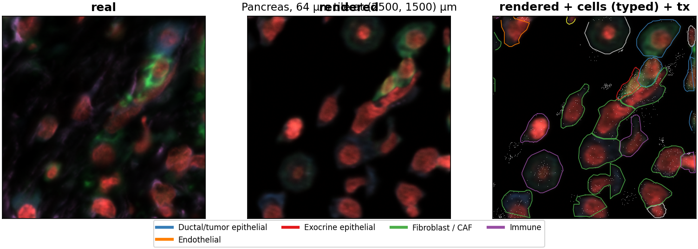

# Pancreas vignette

End-to-end walkthrough on the 10x Xenium **Human Pancreas FFPE** bundle:
download the data, fit a model, render a single tile, then render the
whole bundle. If you've never touched xeSim before, this is the page to
read first.

## 1. Inputs

Two artifacts. The Xenium bundle from 10x, and a quick-and-dirty
cell-type annotation we use for demonstration (the model needs *some*
per-cell type labels — in real work use your own).

### 1a. Xenium bundle

Pancreas membrane, 377-gene panel. From the public 10x Genomics datasets
page:

```bash
mkdir -p data && cd data
curl -O https://cf.10xgenomics.com/samples/xenium/2.0.0/Xenium_V1_human_Pancreas_FFPE/Xenium_V1_human_Pancreas_FFPE_outs.zip
unzip Xenium_V1_human_Pancreas_FFPE_outs.zip -d Xenium_pancreas
```

After unzipping you should have `Xenium_pancreas/` containing
`cells.parquet`, `cell_boundaries.parquet`, `transcripts.parquet`,
`morphology.ome.tif`, `morphology_focus/`, etc.

### 1b. Annotations

The matching cell-type and domain annotations are mirrored at
`pklab.org`:

```bash
mkdir -p Xenium_pancreas/annotations && cd Xenium_pancreas/annotations
curl -O http://pklab.org/peterk/cellAdmix/examples/pancreas_377/annotations/annotation.csv.gz
curl -O http://pklab.org/peterk/cellAdmix/examples/pancreas_377/annotations/domain_annotation.csv.gz
cd ../..
```

These are **illustration-grade labels**, not curated ground truth. They
exist so the example reproduces; for a real analysis bring your own
type annotation (columns `cell_id` and `merged_annotation`).

### 1c. Transcript NMF priors (cellAdmix)

xeSim's transcript model is built on a `cellAdmix-core` NMF run. On
first `fit-model` invocation xeSim runs `cellAdmix` itself and caches
the result at `<bundle-parent>/_xesim_celladmix/runs/...`. You can also
pre-run cellAdmix once and point at it with `--celladmix-run`. See
[`docs/quickstart.md`](quickstart.md) for the cellAdmix install steps.

If you just want to render morphology (no transcript NMF), pass
`--no-transcripts` to `fit-model` and skip cellAdmix entirely.

## 2. Fit a model

```bash
xesim fit-model data/Xenium_pancreas \
    --annotations data/Xenium_pancreas/annotations/annotation.csv.gz \
    --out pancreas_model/ \
    --crop-selection stratified --stratified-within-pick density
```

`--crop-selection stratified --stratified-within-pick density` selects
training crops by composition-aware k-medoids (clusters windows by
cell-type composition, then picks one densely-populated window per
cluster). This gives the renderer balanced exposure to islets, acini,
ducts, and stroma — useful on a heterogeneous pancreas section. Drop
the flags for the simpler density-only default.

On a recent GPU (A100): canonicalize ~1 min, train 8000 steps ~17 min.
The output `pancreas_model/` is self-contained — `manifest.json`,
`renderer.pt`, per-channel priors, exemplars, and diagnostics. See
[`docs/model.md`](model.md) for what's inside.

The two diagnostics worth glancing at:

- `pancreas_model/diagnostics/training_loss.png` — loss curves. The
  validation DINO score should drop steeply in the first ~2000 steps
  then settle around 0.2 by step 8000.
- `pancreas_model/diagnostics/nucleus_prior_fit.png` — per-type 3D
  nucleus shape priors. Check that the distributions for major types
  look unimodal.

## 3. Render a single tile

The fastest way to spot-check the model. `--tile X,Y` renders a 64 µm
crop centered at (X, Y) µm and writes a small inspectable scene
directory (no Xenium-format wrapping).

```bash
xesim explain data/Xenium_pancreas --model pancreas_model/ \
    --out look/ --tile 2500,1500
```

Output (`--format scene`, the default for `--tile`):

```
look/
├── morphology.png        # quick 3-color RGB visualization
├── morphology.npy        # raw (C, H, W) float32 render
├── transcripts.parquet
├── cells.parquet
└── summary.json
```

`morphology.png` is what you want to look at first: DAPI in red,
membrane in green, polyA / 18S as backdrop. Compare to the same crop
of the real bundle — cell density, nuclear texture, and the membrane
ring on epithelial cells should all line up.



If something looks off (cells in the wrong place, ringing, missing
membrane), re-run with `--add-transcript-proposed` to also pick up
cells inferred from transcript clusters, or with
`--intensity-calibration scale` to renormalize per-channel intensities
to the real bundle's display range.

## 4. Render the whole bundle

Same command, no scope flag → covers the bundle's full FOV and writes
a valid Xenium-format directory:

```bash
xesim explain data/Xenium_pancreas --model pancreas_model/ \
    --out pancreas_synth/ --num-workers 2
```

A few timing data points from a 2026-05 run on an A100 + 12-core box:

| Stage | Time |
|---|---|
| Tile rendering (1440 tiles, 2 workers) | ~12 min |
| Bundle write (4-channel morphology, transcripts, polygons) | ~5–10 min |
| **Total** | **~20 min** |

`--num-workers 4` is safe on this hardware (each worker holds ~4 GB of
plane cache; the bottleneck is CPU, not GPU). Bump it up if you have
the cores.

### Output layout

The output is a Xenium-format bundle and loads in Xenium Explorer
unchanged:

```
pancreas_synth/
├── morphology.ome.tif               # 4-channel pyramid
├── morphology_focus/
│   ├── morphology_focus_0000.ome.tif   # DAPI
│   ├── morphology_focus_0001.ome.tif   # ATP1A1 / CD45 / E-Cadherin
│   ├── morphology_focus_0002.ome.tif   # 18S
│   └── morphology_focus_0003.ome.tif   # alphaSMA / Vimentin
├── cells.parquet                    # synthesized cells (one row per cell)
├── cell_boundaries.parquet
├── nucleus_boundaries.parquet
├── transcripts.parquet              # x_location, y_location, gene, cell_id
├── gene_panel.json
├── experiment.xenium
└── ground_truth/
    ├── cells_synth.parquet          # full per-cell causal state
    └── molecule_provenance.parquet  # source of each transcript
```

`ground_truth/` is the synth-specific addition not present in real
bundles — it preserves the per-cell type, per-cell latent, and
per-molecule provenance so downstream evaluation can score against
known truth.

## 5. Useful next steps

- **2.5D (z-stack) rendering**: pass `--scene-mode 2.5d` to add a
  multi-z DAPI stack (12 planes, 33 µm depth) for tools that consume
  Xenium Explorer's z-slider. Adds ~2–3× to wall-time. See
  [`docs/quickstart.md`](quickstart.md#25d-z-stack-output).
- **Single region (instead of single tile)**: replace `--tile X,Y`
  with `--region xmin,ymin,xmax,ymax` to get a multi-tile stitched
  bundle for a rectangular area.
- **Inspect a fitted model**: `xesim inspect-model pancreas_model/`
  dumps the manifest, type taxonomy, and prior sizes.
- **Diagnostics on whole-bundle output**: drop `--no-diagnostic` to
  get the standard real-vs-synth comparison panels in
  `pancreas_synth/diagnostics/` — multi-scale grids that anchor to
  real bundle picks and show per-cell-type fidelity.
- **Augmentations**: `--add-transcript-proposed` recovers cells from
  orphan transcript clusters; `--stamp-transcripts` writes cellAdmix
  type calls onto every transcript. Both require the model to have
  been fitted with cellAdmix priors (i.e. not `--no-transcripts`).

For the full feature surface, see [`docs/quickstart.md`](quickstart.md);
for the model internals, [`docs/model.md`](model.md).
