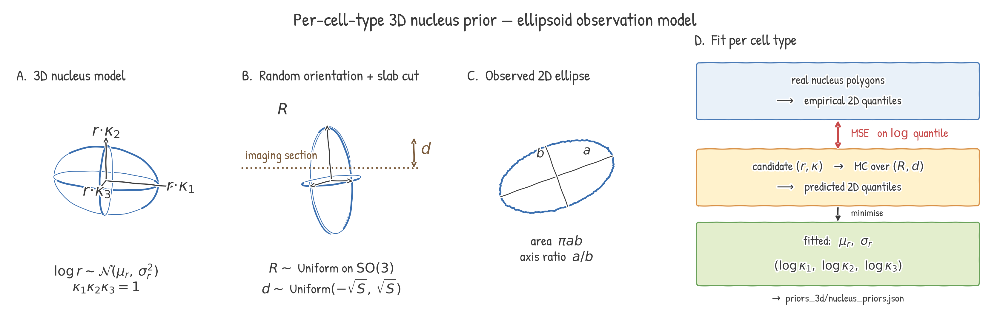

# Prior estimation

xeSim fits per-cell-type 3D nucleus shape priors as a routine step of
`xesim fit-model` and exposes a standalone CLI (`xesim fit-priors`)
for the same fit on its own. This document explains **what is being
modeled** and **why** the model takes the form it does.

## Why a 3D prior is needed for 2D-only data

Xenium morphology imaging captures a thin tissue section. The 2D
nucleus polygons stored in `nucleus_boundaries.parquet` are **plane
cuts through 3D objects** — not the full 3D shape. Two nuclei of
different 3D shape (a small round one vs a large elongated one
oriented along the imaging axis) can produce the same 2D outline.

When `xesim explain --scene-mode 2.5d` renders a z-stack, it needs to
know the **3D extent** of each cell — how far above and below the
imaging plane the nucleus continues, and at what orientation. That
information cannot be read directly from 2D polygons; it has to be
**inferred from the population-level distribution of 2D shapes** under
an assumed 3D model.

The population-level inference is tractable: given the empirical 2D
area + axis-ratio distribution per cell type, the corresponding 3D
ellipsoid parameters can be identified with enough precision to drive
useful per-cell z-priors (cross-type nucleus-elongation 95% CI narrows
by 14%, up to 54% on Exocrine cells in the pancreas reference dataset,
with multi-z DAPI).

## The model



### A — 3D nucleus = triaxial ellipsoid

Each cell-type's nucleus is modeled as a **triaxial ellipsoid** with
random axes drawn from a per-type distribution. The parameterization
separates **size** from **shape**:

- $r$ — equivalent radius (µm), drawn from a log-normal:
  $\log r \sim \mathcal{N}(\mu_r, \sigma_r^2)$.
- $\kappa = (\kappa_1, \kappa_2, \kappa_3)$ — **volume-preserving**
  axis ratios, $\kappa_1 \kappa_2 \kappa_3 = 1$. The three ellipsoid
  semi-axes are $r \cdot \kappa_i$. The constraint $\sum_i \log \kappa_i = 0$
  ensures the ellipsoid has volume $\frac{4}{3}\pi r^3$ regardless of
  anisotropy.

A spherical nucleus has $\kappa = (1, 1, 1)$. A flattened oblate
nucleus has $\kappa_3 < 1 < \kappa_1, \kappa_2$. A rod-shaped fibroblast
nucleus has $\kappa_1 > 1 > \kappa_2, \kappa_3$.

### B — Observation model: random orientation + section depth

The 3D nucleus sits in the tissue at some unknown orientation, and the
microscope cuts a thin plane through it at some unknown depth. xeSim's
model:

- **Orientation** $R \sim$ Uniform on $\mathrm{SO}(3)$ — sampled by QR
  decomposition of a $3 \times 3$ Gaussian matrix.
- **Section depth** $d \sim$ Uniform on $(-\sqrt{S},\, \sqrt{S})$ where
  $S = n^\top \mathrm{diag}(\text{axes}^2)\, n$ is the maximum
  signed-distance the plane can sit from the ellipsoid center along
  the body-frame plane normal $n$.

The uniform-orientation × uniform-depth observation model is the
standard population-level assumption for stereology — it's what makes
the 2D area / axis-ratio distribution a function of the 3D parameters
alone.

### C — Observed 2D ellipse (closed-form)

The intersection of a plane with a triaxial ellipsoid is **always an
ellipse**, and its axes can be computed analytically from
$(r, \kappa, R, d)$:

- Ellipse center: $q_0 = d \cdot n$.
- Ellipse axes: from the eigenvalues of $U^\top M U$ where $U$ spans
  the plane orthogonal to $n$ and $M = \mathrm{diag}(1 / (\text{axes})^2)$.
- Area: $\pi a b$, with $(a, b)^2 = (1 - d^2/S) / \lambda_{1,2}$.

This closed form is what makes the fit fast — no per-sample numerical
integration. The code is in
`xesim/scene_2_5d/nucleus_prior.py::expected_nucleus_section_quantiles`
(vectorized over $N$ Monte-Carlo samples; $N = 4000$ is typical).

### D — Fit objective: 2D-quantile match

For each cell type:

1. **Empirical target.** From the real bundle's
   `nucleus_boundaries.parquet`, compute per-nucleus 2D area and axis
   ratio. Keep only cells fully inside the FOV (no truncation bias).
   Take the (p10, p25, p50, p75, p90) quantiles per type.

2. **Predicted distribution.** Given a candidate
   $(\mu_r, \sigma_r, \log\kappa)$, run a Monte-Carlo simulation:
   sample 4000 $(r, \kappa)$ triples, 4000 rotations, 4000 depths;
   compute 2D area + axis-ratio analytically. Take the same quantiles.

3. **Loss.** Mean-squared error in **log-quantile space** (so the loss
   is dimensionless and balances small vs large cells fairly):
   $\mathcal{L} = \sum_q (\log Q_{\text{emp}}(q) - \log Q_{\text{pred}}(q))^2$
   over both area and axis-ratio quantiles.

4. **Optimizer.** Plain gradient descent on
   $(\mu_r, \sigma_r, \log\kappa_1, \log\kappa_2)$ — 80 iterations is
   sufficient. $\log\kappa_3 = -(\log\kappa_1 + \log\kappa_2)$ is
   determined by the volume-preserving constraint.

On the pancreas bundle (121k cells, 7 cell types):

| Stage | Time | Notes |
|---|---|---|
| Read `nucleus_boundaries.parquet` | 0.12 s | |
| Vectorized per-cell stats | 2.84 s | `np.add.reduceat` over polygon vertices |
| Per-type fit | 1.19 s | 7 types × 80 iter × 4000 MC samples, sample pool reused across iterations |
| **Total** | **~4 s** | written to `priors_3d/nucleus_priors.json` |

## Standalone CLI: `xesim fit-priors`

For population-level shape analyses or hand-iterating the 2.5D
z-prior without paying for a full 30-minute model fit, run the priors
fit on its own:

```bash
xesim fit-priors PATH/TO/BUNDLE \
    --annotations PATH/TO/annotation.csv.gz \
    --out priors_out/    # writes priors_out/nucleus_priors.json
```

Flags:

| Flag | Default | Effect |
|---|---|---|
| `--type-col` | `merged_annotation` | column name in annotation CSV holding the cell-type label |
| `--min-per-type` | `30` | skip cell types with fewer than this many cells |
| `--n-iter` | `80` | gradient-descent iterations per type |
| `--n-samples` | `4000` | Monte-Carlo samples per fit iteration |
| `--seed` | `0` | reproducible RNG |

The full `fit-model` always runs this step internally and writes the
result into `<MODEL_DIR>/priors_3d/nucleus_priors.json`; the standalone
CLI just exposes the fit as its own verb.

## Output

`nucleus_priors.json` is a single JSON object. Here is the full layout
and how to read each field — the same schema is used both when
`fit-model` runs the fit internally and when `fit-priors` runs it
standalone.

```json
{
  "type": "xesim.fit_priors.v1",
  "schema_version": "0.2.0",
  "kind": "nucleus",
  "n_records_used": 121693,

  "per_type_summary": {                         // 2D empirical, per type
    "Ductal/tumor epithelial": {
      "n": 28847,
      "area_p10": 14.0,  "area_p25": 22.4,
      "area_p50": 32.0,  "area_p75": 45.4,
      "area_p90": 65.8,
      "axis_ratio_p10": 1.14, ..., "axis_ratio_p90": 2.09
    },
    ...
  },

  "per_type_z_summary": {                       // populated if z-attrs are
    "Ductal/tumor epithelial": {                // present (multi-z DAPI)
      "n": 28847,
      "z_extent_p10": 7.2, "z_extent_p50": 11.1, "z_extent_p90": 18.4
    },
    ...
  },

  "priors": {                                   // ← the fitted prior itself
    "Ductal/tumor epithelial": {
      "name": "Ductal/tumor epithelial",
      "n_train": 28847,
      "log_radius_mean": 1.466,                 // µ_r  (log-µm)
      "log_radius_std":  0.145,                 // σ_r  (log-µm)
      "axis_ratio_log_kappa": [0.103, 0.267, -0.370],   // (κ₁,κ₂,κ₃), Σ=0
      "target_area_quantiles":       {"p10":14.0,"p25":22.4,...},
      "target_axis_ratio_quantiles": {"p10":1.14,"p25":1.25,...},
      "fit_diagnostics": {
        "final_loss": 0.047,
        "final_quantiles": {
          "area":       {"p10":9.6,"p25":22.3,"p50":38.0,"p75":54.1,"p90":69.9,
                          "median":38.0,"mean":39.7,"std":23.5},
          "axis_ratio": {"p10":1.21,"p25":1.37,"p50":1.57,"p75":1.69,"p90":1.80,
                          "median":1.57,"mean":1.53,"std":0.21}
        },
        "n_iter": 80, "n_samples": 4000,
        "init_lm": 1.497, "init_ls": 0.30, "init_eta1": 0.185, "init_eta2": 0.0
      }
    },
    ...
  },

  "timings_s": {
    "read_parquet":   0.12,
    "per_cell_stats": 2.21,
    "edge_status":    0.12,
    "attach_types":   0.51,
    "fit":            1.21
  }
}
```

### Field-by-field

**Top-level meta**:
- `type`, `schema_version`, `kind` — identifiers; current schema is
  `xesim.fit_priors.v1` / `0.2.0`. `kind: nucleus` reserves room for a
  future `kind: cell` (body) priors variant from `section_prior.py`.
- `n_records_used` — number of nucleus polygons that entered the fit
  after the inside-FOV and have-annotation filters. Cells touching
  the FOV edge are dropped to avoid truncation bias.

**`per_type_summary`** — the 2D empirical target distribution. For each
type, the quantiles (p10/p25/p50/p75/p90) of the observed nucleus
**area** (µm²) and **axis ratio** (major/minor of the fitted 2D
ellipse, ≥1). This is what the fit tries to match.

**`per_type_z_summary`** — present when `cells_z.parquet` is available
(produced by `fit_bundle_cells_z` from `morphology.ome.tif`). Per-type
quantiles of `z_extent_um`, useful both for sanity-checking the multi-z
DAPI fit and for prior-on-prior validation. Empty when running on a
2D-only bundle.

**`priors[<cell_type>]`** — the fitted parameters per cell type:

- `log_radius_mean = µ_r` and `log_radius_std = σ_r` — log-normal
  parameters on the **3D equivalent radius** (µm). Convert: median
  radius = `exp(µ_r)` µm; **median volume** = `(4/3)π · exp(3µ_r)` µm³.
  E.g. ductal: `exp(1.466) ≈ 4.3 µm` median radius → ~340 µm³ median
  volume. `σ_r ≈ 0.05–0.15` across the pancreas types.
- `axis_ratio_log_kappa = (log κ₁, log κ₂, log κ₃)`, summing to 0
  (volume-preserving). The three semi-axes are
  `(r·exp(log κ₁), r·exp(log κ₂), r·exp(log κ₃))`. Spherical: all
  zeros. Prolate (rod): one large positive, two equally negative.
  Oblate (disc): one large negative, two equally positive. For
  Fibroblast / CAF the values are `(0.54, 0.09, -0.63)` — prolate
  with primary axis ~1.7× the equivalent radius and the other two
  axes ~0.6–0.9× — i.e. rod-shaped, matching the elongated CAF
  phenotype.
- `target_area_quantiles`, `target_axis_ratio_quantiles` — the
  empirical targets carried into the fit, repeated here so the JSON
  is self-contained (without needing `per_type_summary`).
- `fit_diagnostics.final_loss` — final MSE in log-quantile space.
  Typical values 0.04–0.07 across all 7 pancreas types; nothing
  outside that range so far.
- `fit_diagnostics.final_quantiles` — the **predicted** quantiles
  produced by the fitted prior. Compare with `target_*` to see how
  well each type matched. Often the synthesized p10 / p90 are
  slightly compressed vs target, which is the volume-preserving
  ellipsoid being too restrictive to span the empirical extremes;
  the median almost always lines up within a few percent.
- `fit_diagnostics.init_*` — initial values of `(µ_r, σ_r, η₁, η₂)`
  the optimizer started from (derived from `target_area_p50` and
  `target_axis_ratio_p50`). Recorded so a re-run with different
  `--n-iter` is reproducible.
- `n_iter`, `n_samples` — what the fit actually ran (echoes the CLI
  flags).

**`timings_s`** — wall-clock per stage; useful when profiling a
large-bundle run. The `fit` line is for all types combined and uses
the same Monte-Carlo sample pool across iterations (the optimization
that made the fit 8.4× faster on the pancreas bundle).

### Reading the per-type result table

The `fit-priors` CLI prints a one-line-per-type summary after writing
the JSON:

```text
type                                   n   log r̄  log r std      κ₁     κ₂     κ₃
Ductal/tumor epithelial            28847    1.466      0.145   0.103  0.267 -0.370
Immune                             19191    1.131      0.050  -0.100  0.473 -0.372
Fibroblast / CAF                   28335    1.237      0.092   0.538  0.088 -0.626   ← rod-shaped
Exocrine epithelial                33730    1.283      0.050  -0.023  0.323 -0.300
Endocrine                           2056    1.305      0.050   0.008  0.312 -0.320
Mural / pericyte                    2551    1.105      0.114   0.029  0.529 -0.558   ← elongated
Endothelial                         6979    1.236      0.114   0.465  0.115 -0.580   ← elongated
```

- `log r̄` (i.e. `log_radius_mean`): roughly log(equivalent radius in µm).
  Translate: median radius = `exp(log r̄)` µm. Most pancreas types
  cluster around 1.1–1.5 → 3–5 µm median radius → 110–500 µm³ median
  volume.
- `log r std`: how heavy-tailed each type is in size. Endocrine and
  exocrine epithelials are tightly clustered (0.05); ductal cells and
  endothelial / pericyte / fibroblast lineages are more variable
  (0.09–0.15).
- `κ₁, κ₂, κ₃` (log axis ratios): sign pattern reveals shape.
  - Two negative + one large positive ⇒ prolate (rod-like): fibroblasts,
    pericytes, endothelial.
  - All near zero ⇒ near-spherical: exocrine, endocrine.

These match the biological priors: stromal lineages have rod-shaped
nuclei; epithelial parenchyma stays compact.

### A note on what's *not* in the output

Per-cell `z_center_um` and `z_extent_um` — the inferences the
multi-z DAPI path makes for each individual cell — are stored
**separately**, in `<bundle>/_xesim_z_attrs/cells_z.parquet`, by
`xesim.scene_2_5d.z_attrs.fit_bundle_cells_z`. The priors JSON only
holds the *population-level* per-type distributions; per-cell
inferences are conditioned on those priors at render time. Splitting
the two keeps the priors file small (a few kB) and the bundle-scoped
per-cell file co-located with the bundle data.

## How the priors are used downstream

1. **Auto-discovery.** `xesim.scene_2_5d.tilt.load_nucleus_priors_table`
   looks for `<MODEL_DIR>/priors_3d/nucleus_priors.json`; falls back to
   a **single median default** $(\text{vol}_{\mu^3}{=}130,\, \text{elong}{=}3.6)$
   if no file is found. No per-tissue hardcoded table — the prior is
   always either bundle-fit or a single neutral value.

2. **Per-cell z-extent.** Given an observed 2D area $A_\text{obs}$ and a
   fitted prior, `initialize_tilts` solves for the cell's likely
   z-extent and tilt orientation. Cells with extreme 2D areas (very
   small or very large) tend to be tilted; medium areas tend to be
   near-equatorial.

3. **MRF smoothing.** A Markov-random-field pass over neighboring
   cells encourages locally consistent tilt — adjacent nuclei in the
   same tissue domain should tilt similarly.

4. **2.5D render.** At each z-plane the renderer sees the cross-section
   of each tilted ellipsoid, producing realistic depth-of-field
   patterns (cells go in and out of focus).

## Cell-level priors (additive future work)

`xesim/scene_2_5d/section_prior.py` provides the same machinery for
fitting **cell-body** (not nucleus) priors — useful when cell
boundaries are available and the renderer wants per-cell z-extent
beyond just the nucleus. Same model class (triaxial ellipsoid, log-
normal radius, log-kappa anisotropy), same fit objective, just
applied to `cell_boundaries.parquet` instead of `nucleus_boundaries`.
Currently not auto-wired into `fit-model` — call directly via the
Python API or the `xesim fit-priors` CLI if needed.

## See also

- [`model.md`](model.md) — where 3D priors fit in the broader xeSim
  generative pipeline.
